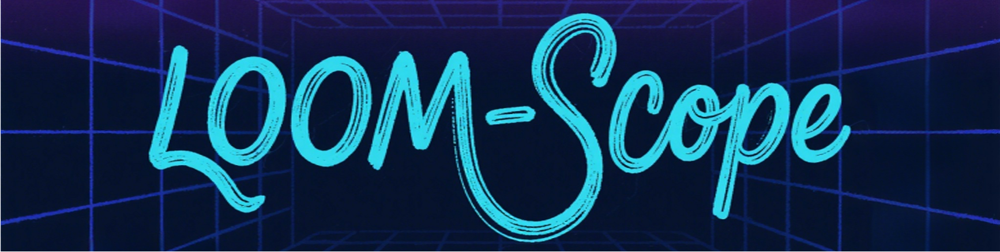

<h3 align="center">🎓 Master's Student | 🤖 AI Researcher | 🔬 LLM Optimization Enthusiast</h3>

  
  
  
  
  

---

<table>
  <tr>
    <td width="60%" valign="top">

## 🚀 About Me

I am a **Master's student** at the **Key Laboratory of Data Intelligence and Advanced Computing, Soochow University**, actively researching under the supervision of **Professor Juntao Li**.

My passion lies in squeezing performance out of large models. I focus on:

- 🧠 **Efficient LLM Inference**: Making models faster and lighter.
- 💾 **KV-Cache Compression**: Optimizing memory usage.
- ⚡ **Sparse Attention Mechanisms**: Reducing computational complexity.

> *"Advancing the field of AI through innovative computational approaches."*

    </td>
    <td width="40%" align="center">
      
    </td>
  </tr>
</table>

## 🛠️ Arsenal & Interests

<table>
  <tr>
    <td width="50%" valign="top">
      <h3 align="center">🔬 Research Focus</h3>
      <ul>
        <li><b>LLM Optimization</b> (Pruning, Quantization)</li>
        <li><b>KV-Cache Compression</b></li>
        <li><b>Sparse Attention</b></li>
        <li><b>Deep Learning Frameworks</b></li>
      </ul>
    </td>
    <td width="50%" valign="top">
      <h3 align="center">💻 Tech Stack</h3>
      

        
        
        
         
        
        
        
      

    </td>
  </tr>
</table>

---

## 📊 GitHub Analytics

  <table>
    <tr>
      <td>
        
      </td>
      <td>
        
      </td>
    </tr>
  </table>

---

## 🏆 Featured Project

| **LOOM-Scope** |
| :---: |
|  |
| **Advanced AI Research Project** |
| 🚀 *Cutting-edge research in Large Language Model optimization* |
| [**Explore Repository**](https://github.com/LCM-Lab/LOOM-Scope) |

 

  
   
  <i>"Talk is cheap, show me the code."</i>

